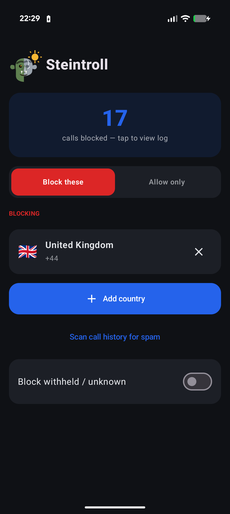
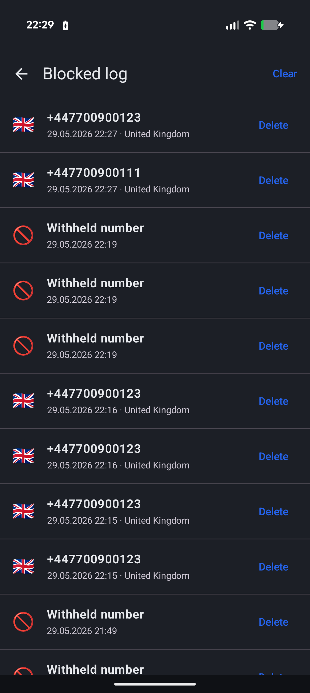
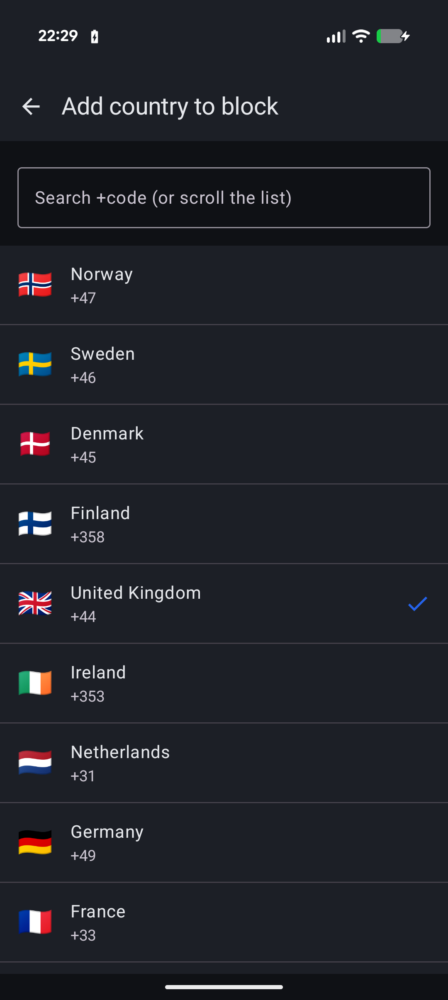
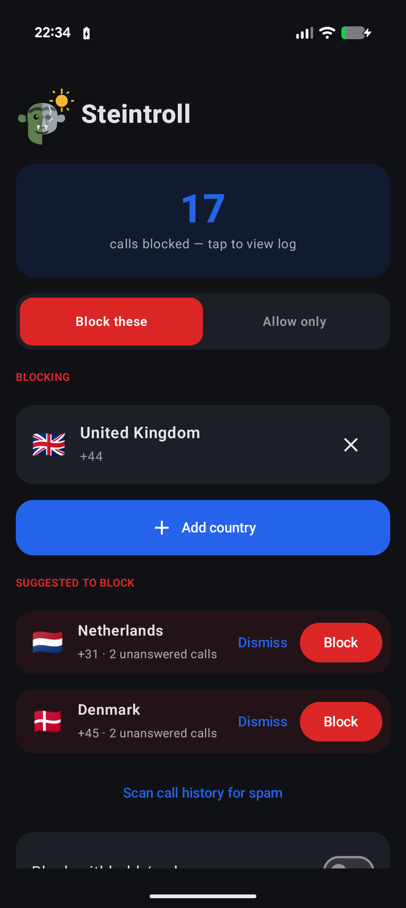
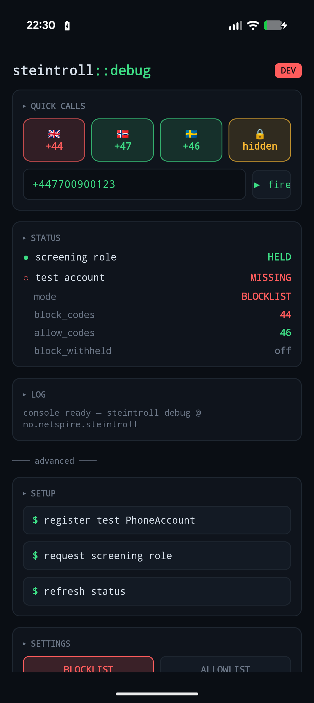
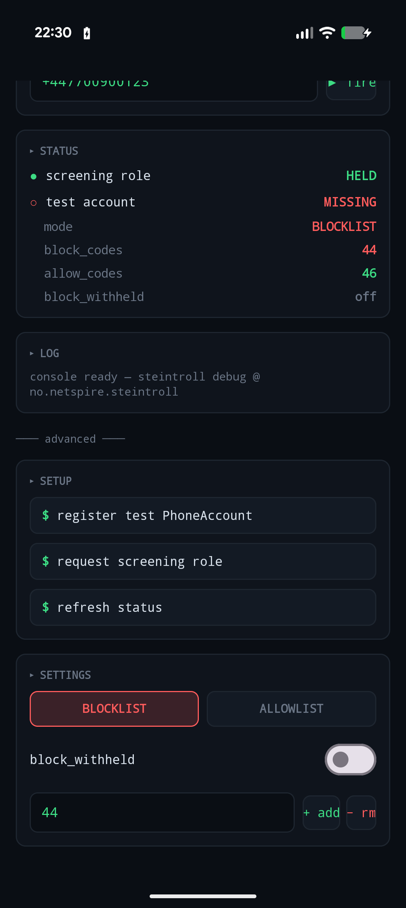

# 🗿 Steintroll

**Silently block incoming phone calls by country calling code.**

Steintroll is a small, private Android app that screens incoming calls and silently
rejects any from country codes you choose — no ring, no vibration, no missed-call
notification. It was built to stop a relentless wave of spam calls from a single
country that kept rotating phone numbers, where blocking individual numbers was
hopeless.

The name is from Norse folklore: trolls turn to stone in sunlight. A spam "troll"
call gets caught and petrified — silently rejected.

> **This is a build-it-yourself app.** It is **not** on the Google Play Store. You
> compile it from this source and install it on your own device. See
> [Build & install](#build--install). You are responsible for building, installing,
> and running it on hardware you own — see [Privacy, permissions & disclaimer](#privacy-permissions--disclaimer).

---

## What it does

- **Blocks by country code, not by number.** Add `+44` (UK) and *every* call from a
  UK number is rejected — including new numbers you've never seen. This is what
  makes it effective against spammers who rotate numbers.
- **Two modes:**
  - **Block these** (blocklist) — allow all calls except the country codes you list.
  - **Allow only** (allowlist) — block all calls except the country codes you list.
    Useful for, say, an elderly relative who should only receive calls from a few
    known countries.
- **Block withheld / unknown** — an independent toggle for private / no-caller-ID calls.
- **In-app log** of every call it rejected (number, country, time) — review what it
  caught without cluttering your real call log.
- **Scan call history for spam** — optionally analyses your call log and suggests
  foreign country codes that keep calling but you never actually talk to.
- **Works when the app is closed.** Blocking runs through Android's call-screening
  framework, which the system starts on demand — you never have to open the app.
- **Fully offline.** No network, no accounts, no analytics. Everything stays on your
  device.

## Screenshots

| Home | Blocked log | Add country | Spam suggestions |
|------|-------------|-------------|------------------|
|  |  |  |  |

## How it works

Steintroll registers a [`CallScreeningService`](https://developer.android.com/develop/connectivity/telecom/dialer-app/screen-calls).
For each incoming call, Android hands the service the caller's number *before it
rings*. Steintroll resolves the number's country calling code (longest-prefix match),
applies a small pure decision function against your settings, and responds with
either "allow" or "disallow + reject + skip notification + skip call-log."

It deliberately does **not** become your default Phone/dialer app — it only takes the
call-screening role, which is the least-invasive way to do this.

The blocking logic is a pure, dependency-free function with a full unit-test suite, so
its behaviour is verifiable without a device.

For a fuller explanation of the architecture and the reasoning behind it, see
[docs/design/DESIGN.md](docs/design/DESIGN.md).

## Build & install

You build the app yourself and install it on your own phone over USB (or Wi-Fi). This
needs the standard Android toolchain.

### Prerequisites

- **Android Studio** (latest) — includes the Android SDK and a bundled JDK.
- **Android SDK** with the **Android 16 (API 36)** platform and recent build-tools
  (installed via Android Studio's SDK Manager).
- A device running **Android 10 (API 29) or newer** — that's the minimum for silent
  call rejection. (Built and tested on a Pixel 10 Pro / Android 16.)

No separate JDK install is required: the project points command-line Gradle at the JDK
bundled with Android Studio.

### Option A — Android Studio (easiest)

1. Clone this repo and open the folder in Android Studio.
2. Let it sync Gradle and download dependencies.
3. Enable **Developer options** + **USB debugging** on your phone, connect it.
4. Press **Run** (or Shift+F10). The app installs and launches.

### Option B — command line

```bash
git clone https://github.com/netspire-no/android-steintroll.git
cd android-steintroll

# Point Gradle at Android Studio's bundled JDK if needed (macOS path shown):
#   echo 'org.gradle.java.home=/Applications/Android Studio.app/Contents/jbr/Contents/Home' >> gradle.properties
# Tell Gradle where your SDK is (Android Studio usually writes this for you):
#   echo 'sdk.dir=/Users/<you>/Library/Android/sdk' > local.properties

# Build and install the debug app onto a connected device:
./gradlew installDebug
```

Run the test suite with `./gradlew test`.

> `local.properties` (your SDK path) and `gradle.properties`' machine-specific
> `org.gradle.java.home` line are environment-specific and not committed.

### First run — grant the role

1. Open Steintroll. Tap **Enable call blocking**.
2. Android shows a system dialog asking which app should screen your calls — **choose
   Steintroll**. (Choosing "Phone" or "None" leaves blocking off.)
3. Tap **+ Add country**, pick the country code(s) to block, and you're protected.

The role and your settings persist across reboots; you don't need to keep the app open.

## Usage notes

- **Country codes aren't 1:1 with countries.** `+1` covers the US, Canada and much of
  the Caribbean; `+7` covers Russia and Kazakhstan. Blocking is by dial-code prefix,
  so blocking `+1` blocks all of them together.
- **Allowlist mode blocks everything not listed** — including your own country, unless
  you add it. (In "Allow only" with just Sweden listed, only Swedish numbers ring.)
- **Block withheld** is independent of mode — it only affects calls with no caller ID.

## Troubleshooting

- **Calls still get through.** Make sure Steintroll actually holds the call-screening
  role: open the app — if the "Enable call blocking" banner is showing, the role isn't
  granted yet. Only one app can hold the role at a time. Also remember blocking is by
  *country code*, so the calling number must resolve to a code on your list.
- **Stuck on the splash screen (the troll icon) on launch.** That screen is Android's
  cold-start splash, not an in-app loading screen — the app draws its first frame in
  well under a second on a healthy device. If it lingers, the device itself was likely
  busy or unstable; reboot the phone and reopen the app, or reinstall
  (`./gradlew installDebug`). Your settings live in app storage, so a reinstall over
  the top keeps them; a full uninstall clears them.
- **Allowlist mode blocked a call you wanted.** In "Allow only" mode *everything* is
  blocked except the codes you list — including your own country. Add the codes you
  want to receive (e.g. your home country) to the allow list.

## Privacy, permissions & disclaimer

- **Everything runs locally.** Steintroll makes no network requests and collects no
  data. Your settings and the blocked-call log never leave your device.
- **Minimal permissions.** It uses only:
  - The **call-screening role** — to see incoming numbers and reject calls.
  - `READ_CALL_LOG` — requested **only** if you tap "Scan call history for spam," and
    used purely on-device to suggest country codes. Nothing is uploaded.

  That's it. No contacts access, no network, no SMS, and it never becomes your default
  dialer.
- **You build and install this yourself**, on hardware you own. It is provided as-is,
  with **no warranty** (see [LICENSE](LICENSE)). Call screening can affect whether you
  receive legitimate calls; configure it deliberately and verify it behaves the way
  you expect for your situation. Use of this software, and any calls it allows or
  blocks, are your responsibility.

## Debug companion

Debug builds include a second launcher entry, **Steintroll Debug** (distinct icon with
a red ribbon), that opens a small on-device test console. Because you can't easily
place real calls on demand to test a call screener, the console registers a local
managed `ConnectionService` and injects **synthetic incoming calls** that flow through
the real `SteintrollCallScreeningService` — so you can verify blocking on a physical
device without making an actual call. It also shows live status (role, settings) and
lets you flip modes and edit the lists.

This console exists **only in debug builds** — it is not present in release builds.

| Test console | Live controls |
|--------------|---------------|
|  |  |

**Verifying blocking with it (one-time setup):**

1. In the console's **Setup** section, tap **register test calling account**.
2. Enable that account: **Settings → Calling accounts → Steintroll Test** (Android
   won't route synthetic calls through it until it's enabled — if test calls seem to
   do nothing, this is usually why).
3. Make sure Steintroll holds the call-screening role (grant it in the main app).
4. Add a country to the block list in the main app, then tap a **quick call** button
   (e.g. 🇬🇧 +44) in the console. A blocked call is silently rejected and appears in
   the in-app log; an allowed number rings through.

The test account and (after a full uninstall) your settings are cleared on reinstall,
so you may need to repeat steps 1–2 and re-add your countries after reinstalling.

## Tech

Kotlin · Jetpack Compose · Material 3 · Room · DataStore · `CallScreeningService`.
Min SDK 29, target SDK 36. No third-party runtime dependencies beyond AndroidX.

## License

[MIT](LICENSE) © 2026 Netspire

---

<p align="center"><sub>🗿 Built by <a href="https://netspire.no">Netspire</a> — for humans, against trolls.</sub></p>
